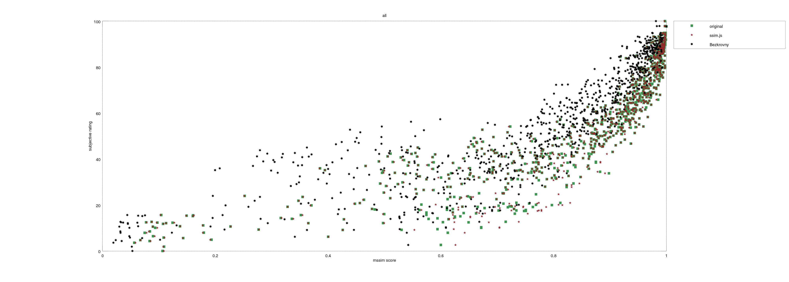

# Bezkrovny

This folder contains scripts related to the comparison of Mean Opinion Score (MOS) and the mean ssim values with those generated by Bezkrovny's implementation of the SSIM algorithm.

While the difference between the algorithm and reported results is greater in Bezkrovny's case, the algorithm is significantly faster and correlates better with MOS values.

The following graph illustrates these differences by looking at all results from the LIVE database ("Release 2"):



## Matlab Comparison

To reproduce these results you first need to run `compareLIVESSIM.m` which will generate the csv files needed for `genresults.js`. Then, running: `node genresults.js` will generate `out.dat` which is needed by the `compare.m` matlab script

in Matlab / Octave you can reproduce the different plots by running:

```Matlab
>> pkg load image
>> compare('fastfading', 809, 982);
>> compare('gblur', 635, 808);
>> compare('wn', 461, 634);
>> compare('jpeg', 228, 460);
>> compare('jp2k', 1, 227);
>> compare('all', 1, 982);
```
